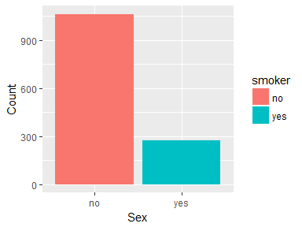

Predicting insurance premium with Regression Modelling
================

Motivation
----------

   Health insurance is one of the most marketed products offered by leading insurance firms. The bottom line in this industry is driven by the simple fact that the capital spent by the insurance company in response to beneficiary claims should not exceed customer premium. Higher the difference between settled claims and total premium received, higher are the profits.   
   In order to maximise the profits, wouldn't it be better if the companies accurately calculate the premium charges as soon as the new customer approaches them? However, that would require building predictive models based upon similar profile of existing cutomers. In the following analysis, we try to analyse the correlations between various customer attributes and develop a predictive model that would help the company charge adequete and appropriate premium to the clients. Also, it could help the prospective clients understand the factors that could lower or hike their insurance premium.

## 1. Loading the dataset
----------------------

``` r
insurance <- read.csv("insurance.csv", stringsAsFactors = TRUE)
```

## 2. Exploring insurance data
---------------------------

First, we will check if data is imported in the expected format from the source file

``` r
str(insurance)
```

    ## 'data.frame':    1338 obs. of  7 variables:
    ##  $ age     : int  19 18 28 33 32 31 46 37 37 60 ...
    ##  $ sex     : Factor w/ 2 levels "female","male": 1 2 2 2 2 1 1 1 2 1 ...
    ##  $ bmi     : num  27.9 33.8 33 22.7 28.9 ...
    ##  $ children: int  0 1 3 0 0 0 1 3 2 0 ...
    ##  $ smoker  : Factor w/ 2 levels "no","yes": 2 1 1 1 1 1 1 1 1 1 ...
    ##  $ region  : Factor w/ 4 levels "northeast","northwest",..: 4 3 3 2 2 3 3 2 1 2 ...
    ##  $ charges : num  16885 1726 4449 21984 3867 ...

We note that sex (M/F), smoker (yes/ no) and four regions of US have been imported as categorical variables as expected.

### 2.1. Distribution of the dependent variable (Insurance charges):

Insurance charge (expense) is the dependent variable based upon other variables (predictors). It is observed that linear regression model fits better when dependent variable exhibits *Normality*. We explore normality in insurance charges.

``` r
summary(insurance$charges)
```

    ##    Min. 1st Qu.  Median    Mean 3rd Qu.    Max. 
    ##    1122    4740    9382   13270   16640   63770

Median value is quite less than mean value implying right skew in distribution of insurance expenses. A histogram would be beneficial in further exploration

``` r
ggplot(insurance, aes(x = charges, fill = cut(x=charges, 100))) +
  geom_histogram(show.legend = FALSE) +
  scale_fill_discrete(h = c(240, 10), c = 120, l = 70) +
  theme_minimal() +
  labs(x = "Insurance charges", y = "Frequency") +
  ggtitle("Histogram of Insuarnce charges")
```


We see that most clients pay insurance charges of less than USD 25000 while very few pay beyond USD 50000

### 2.2. Exploring categorical variables

We have 3 factor variables viz. Sex, Smoker and region. Lets have a look at their distribution:

``` r
#var_factors <- names(Filter(is.factor, insurance))

ggplot(as.data.frame(table(insurance["sex"])), aes(x=Var1, y=Freq, fill=Var1)) + 
 geom_bar(stat = "identity") + labs(x = "Sex", y="Count", fill = "sex")
```


``` r
ggplot(as.data.frame(table(insurance["smoker"])), aes(x=Var1, y=Freq, fill=Var1)) + 
 geom_bar(stat = "identity") + labs(x = "Sex", y="Count", fill = "smoker")
```



``` r
ggplot(as.data.frame(table(insurance["region"])), aes(x=Var1, y=Freq, fill=Var1)) + 
 geom_bar(stat = "identity") + labs(x = "Sex", y="Count", fill = "region")
```


So, variables "sex" and "region" seem to be evenly distributed, whereas number of smokers are substantially lower than non-smokers.

### 2.3. Exploring correlation between the variables

Next, we try to understand the correlation between dependent and explanatory variables. A correlation matrix would be very useful to see the pair wise relationships with numerical variables

``` r
cor(insurance[c("age", "bmi", "children", "charges")])
```

    ##                age       bmi   children    charges
    ## age      1.0000000 0.1092719 0.04246900 0.29900819
    ## bmi      0.1092719 1.0000000 0.01275890 0.19834097
    ## children 0.0424690 0.0127589 1.00000000 0.06799823
    ## charges  0.2990082 0.1983410 0.06799823 1.00000000

There appears to be moderately positive correlation between age, bmi and insurance charges. It seems that as age/ bmim increases, corresponding insurance charges too see a rise. On a side note, age also appears to be weakly positively correlated to insurance charges as older one tends to be, the more they have to cough up for insurance coverage. We visualise these pairwise relationships to check for any other patterns.

``` r
pairs(insurance[c("age", "bmi", "children", "charges")])
```

 From the pairwise scatterplots above, we notice that with higher ages, insurance charges seem to be higher. Also, people with higher BMI (above 30, i.e. obese/ morbidly obese) tend to shell out more money for insurance. Apart from these, other relationships are not clearly visible in the plots. In order to tease out more information from the relationships, we plot a more informative scatterplot matrix.

``` r
pairs.panels(insurance[c("age", "bmi","children", "charges")])
```


The above plot consolidates the correlation between the variable pairs and frequency distributions of the individual features. It supports our earlier observations for relation between age, bmi, children and insurance charges. The flattened <span style="color:blue">correlation ellipse</span> indicates a moderate correlation between age and insurance charges. Similarly, it indicates weak correlation between number of children added on insurance plan and corresponding charges. A more rounder ellipse between means lesser of a correlation between age and number of children on insurance plan.
Another visual aid is the <span style="color:blue">loess curve</span> on the scatterplots. A gradually increasing loess curve shows postive correlation between bmi, age, number of children and insurance charges. Also, an inverted loess curve for the relation between age and children implies that mostly middle aged people have added more number of children on to the insurance plan than the younger or elder people.

3. Train a regression model on the insurance data:
--------------------------------------------------

We use the <span style="font-family:Courier">lm()</span> function to fit a linear regression model on the data. Insurance charges are used as dependent variable whereas all other features are used as explanatory variables to train the model. Upon building the model, we observe the regression coefficient values for each predictor.

``` r
insurance_model <- lm(data = insurance, formula = charges ~ age + sex + bmi + children + smoker + region)
insurance_model
```

    ## 
    ## Call:
    ## lm(formula = charges ~ age + sex + bmi + children + smoker + 
    ##     region, data = insurance)
    ## 
    ## Coefficients:
    ##     (Intercept)              age          sexmale              bmi  
    ##        -11938.5            256.9           -131.3            339.2  
    ##        children        smokeryes  regionnorthwest  regionsoutheast  
    ##           475.5          23848.5           -353.0          -1035.0  
    ## regionsouthwest  
    ##          -960.1

Here, the intercept value does not make much sense as it represents the insurance charges when all other variables are 0 and person with no age and bmi is not possible.

### 3.1. Intrepreting the regression coefficents:

Coefficients of age, bmi, children and smoker are positively related to insurance charges. For each year of increase in age, charges are expected to rise by USD 257 given all other variables stay constant. Similarly, every unit rise in BMI would hike insurance charges by USD 339. Also, an additional child on plan could make insurance dearer by USD 476. *Dummy variables* are included in the regression model in place of categorical features like sex or smoker. Thus, coefficent values are considered as a relative value against other categories in same feature. For instance, insurance could be costlier to smoker by USD 23848 in comparision to non-smoker. Similarly, it owuld be cheaper by USD 131 for males than females and USD 353 cheaper to a person from north west than a person from north east US.

### 3.2. Regression Model - performance evaluation

The above regression analysis, reveals the relationship between dependent variable (insurance charges) and predictors but talks nothing about how well would the model fit the data or generalize the unseen observations.
Hence, we evaluate the model performance now,

``` r
summary(insurance_model)
```

    ## 
    ## Call:
    ## lm(formula = charges ~ age + sex + bmi + children + smoker + 
    ##     region, data = insurance)
    ## 
    ## Residuals:
    ##      Min       1Q   Median       3Q      Max 
    ## -11304.9  -2848.1   -982.1   1393.9  29992.8 
    ## 
    ## Coefficients:
    ##                 Estimate Std. Error t value Pr(>|t|)    
    ## (Intercept)     -11938.5      987.8 -12.086  < 2e-16 ***
    ## age                256.9       11.9  21.587  < 2e-16 ***
    ## sexmale           -131.3      332.9  -0.394 0.693348    
    ## bmi                339.2       28.6  11.860  < 2e-16 ***
    ## children           475.5      137.8   3.451 0.000577 ***
    ## smokeryes        23848.5      413.1  57.723  < 2e-16 ***
    ## regionnorthwest   -353.0      476.3  -0.741 0.458769    
    ## regionsoutheast  -1035.0      478.7  -2.162 0.030782 *  
    ## regionsouthwest   -960.0      477.9  -2.009 0.044765 *  
    ## ---
    ## Signif. codes:  0 '***' 0.001 '**' 0.01 '*' 0.05 '.' 0.1 ' ' 1
    ## 
    ## Residual standard error: 6062 on 1329 degrees of freedom
    ## Multiple R-squared:  0.7509, Adjusted R-squared:  0.7494 
    ## F-statistic: 500.8 on 8 and 1329 DF,  p-value: < 2.2e-16

4. Regression Analysis
----------------------

The summary of regression model has three important components which can be analysed:

### 4.1. Residuals

Residual value is the difference between the actual value and the predicted value. As such, smaller the magnitude of this value, better the model performance. Median residual value is USD -982 while maximum is around USD 30000. This implies that the model underestimates the insurance charges by around USD 982 for most number of cases. However, there has been atleast one observation where charges were underestimated by almost USD 30000. Also, most residual values lie between 1st and 3rd Quartiles i.e. USD 2848 - 1393 which is the range by which most predictions are off by.

### 4.2. Coefficients

The values of coefficients are tested against hypothesis that their slopes are more than 0. ie are they a significant predictor or not. We see, a small p-value associated with hypothesis test of all the variables. Such a small p-value (usually p &lt; 0.005) indicates that corresponding *predicators are statistically significant*. Sex variable has quite high p-value which implies that is unlikely to be a good predictor of insurance charges.

### 4.3. Coefficient of determination

The R.Sq. (coefficient of determination) value lies between \[0, 1\] with values nearer to 1 the better. Multiple R.Sq. = 0.75 implies that model explains about 75% of the variance in predicted values. In other words, only 25% of the variance in predicted values is unexplained which indicates high efficiency of the model to predict insurance prices. Adj. R.Sq. values penalize the additional independent variables and thus are a better indicator than R.Sq. alone. This value of 0.75 represents that model is significant enough to make good prediction of charges given these explanatory variables.   

## 5. Improving the regression model:
----------------------------------

The regression model developed till now assumed only linear relationship between the variable. However, in real world, scenario can be quite complicated. We need to factor in these complications and bring about subtle modifications in the model.

### 5.1. Non-linear relation between age and medical insurance charges:

Based on the insurance domain knowledge, we know that medical insurance charges tend to increase disproportionately with age. Thus, instead of a linear relationship, we consider a higher order relationship with age.   

*C**h**a**r**g**e**s* = *β*<sub>0</sub> + *β*<sub>1</sub>*A**g**e* + *β*<sub>2</sub>*A**g**e*<sup>2</sup>   

This implies, model needs to factor in additional coefficient
*β*<sub>2</sub>
. Hence, we include an additional feature based on sqaure of age as follows,

``` r
insurance$age2 <- insurance$age^2
```

### 5.2. Transforming BMI to categorical value (high/ low):

It is observed that, insurance charges don't vary much for people with average or slightly above average BMI. But, it can really take off for obese and morbidly obese people. We need to consider this logic and add a categorical variable that would indicate if BMI is above a certain high value say, 30.

``` r
insurance$bmi30 <- ifelse(insurance$bmi > 30, 1, 0)
```

### 5.3. Interactive effects of smoking and obesity:

It is regarded that smoking and obesity are both individually detrimental to health. However, we suspect that their combined effect would potentially be more harmful and thus affect the insurance charges. We, therefore, consider an interaction of these two variables in the model (Smoker \* BMI30)

Finally, let us remodel the regression with above considerations and analyse the summary of results.

``` r
insurance_model_updated <- lm(charges ~ age + age2 + children + bmi + sex + bmi30 + bmi30*smoker + region,
                              data = insurance)
summary(insurance_model_updated)
```

    ## 
    ## Call:
    ## lm(formula = charges ~ age + age2 + children + bmi + sex + bmi30 + 
    ##     bmi30 * smoker + region, data = insurance)
    ## 
    ## Residuals:
    ##     Min      1Q  Median      3Q     Max 
    ## -4260.3 -1644.6 -1272.7  -784.7 24192.7 
    ## 
    ## Coefficients:
    ##                   Estimate Std. Error t value Pr(>|t|)    
    ## (Intercept)        69.2494  1353.2349   0.051 0.959195    
    ## age               -21.6786    59.4956  -0.364 0.715638    
    ## age2                3.5978     0.7422   4.847 1.40e-06 ***
    ## children          661.5105   105.2784   6.283 4.48e-10 ***
    ## bmi               114.2920    34.0816   3.353 0.000821 ***
    ## sexmale          -475.6760   242.9293  -1.958 0.050430 .  
    ## bmi30            -938.5116   420.5807  -2.231 0.025817 *  
    ## smokeryes       13421.6370   435.9158  30.790  < 2e-16 ***
    ## regionnorthwest  -275.6659   347.2730  -0.794 0.427453    
    ## regionsoutheast  -826.1187   349.6181  -2.363 0.018275 *  
    ## regionsouthwest -1164.8152   348.5123  -3.342 0.000854 ***
    ## bmi30:smokeryes 19912.6072   600.8493  33.141  < 2e-16 ***
    ## ---
    ## Signif. codes:  0 '***' 0.001 '**' 0.01 '*' 0.05 '.' 0.1 ' ' 1
    ## 
    ## Residual standard error: 4419 on 1326 degrees of freedom
    ## Multiple R-squared:  0.8679, Adjusted R-squared:  0.8668 
    ## F-statistic: 792.1 on 11 and 1326 DF,  p-value: < 2.2e-16

### 5.4. Observations from the updated model

Following observations can be made from the updated regression model:   

**1. Additional variables/ interactions are significant:**    
An extremely low p-value corresponding to newly included variables like bmi30, Sq. age, interaction between smoking and obesity, indicate that these variables are statistically significant and more likely to affect the insurance charges.   
**2. Improved model predictive power:**    
The value of coefficient of determination (R.Sq.) and Adj. RSq. has risen from 76% to 86%. This significant increase is a testimony to improved predictive power of the model. This also means that, unexplained variance is reduced from 24% to just 14% after the improvements.    
**3. Reduction in residual standard error:**    
Residual standard error has fallen down from 6062 to 4419 (about -27%). This implies lesser difference between actual and predicted values on using the improved model.    

The correlation between existing, additional variables and insurance charges is visualized below. As seen in the improved model, smoking, bmi30 and sq.age all seem to be positively correlated with medical expenses

``` r
insurance %>% mutate(Smoking = ifelse(smoker=="yes", 1, 0)) %>%
  select(age,age2,bmi,bmi30,children,Smoking,charges) %>%
  ggcorr(label=TRUE, name="Correlation")
```


<span style="color:blue"> 6. Practical insights from the analysis</span>
------------------------------------------------------------------------

Some of the useful practical insights derived from this predictive regression analysis could be:
1. Smoking alone increases the insurance cost by USD 13400. But, for obese smokers that could result into additional USD 20000. This suggests, smoking and obesity together can be extremely detrimental as far as medical expenses are concerned.
2. Coefficient for age is statistically significant and indicates positive correlation. This means, it is important to plan for spirally (non-linearly) increasing medical costs as one turns older.
3. A significant positive correlation has been observed between BMI and medical expenses. So, it is likely that increase in body weight could cause more spending on medical ailments.
4. Insurance company can factor in interaction between different features like age, BMI, smoking habits in order to predict the insurance premium charges for new customers and adjust those of existing customers.
5. Finally, the insurance company could use such a predictive model to minimize the losses by under-charging a risk prone individual or maximize the profits by appropriately charging them.
